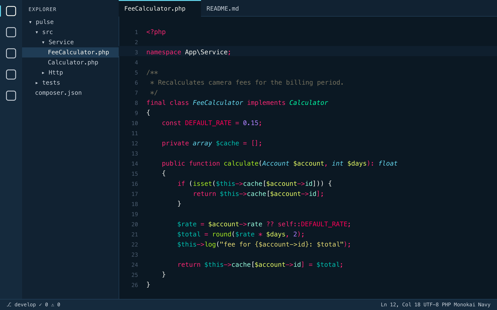
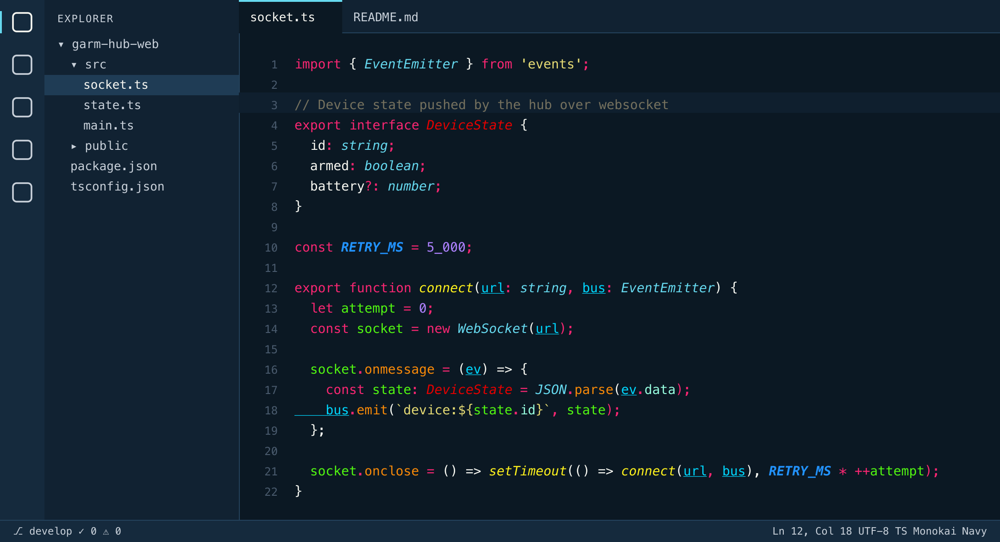
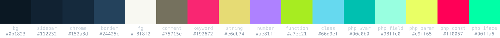
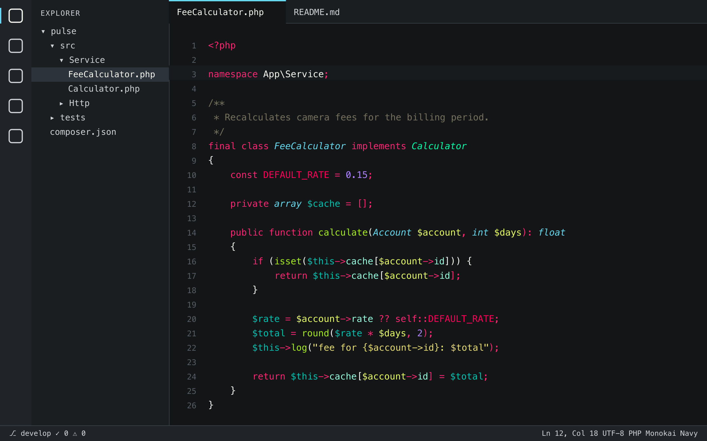
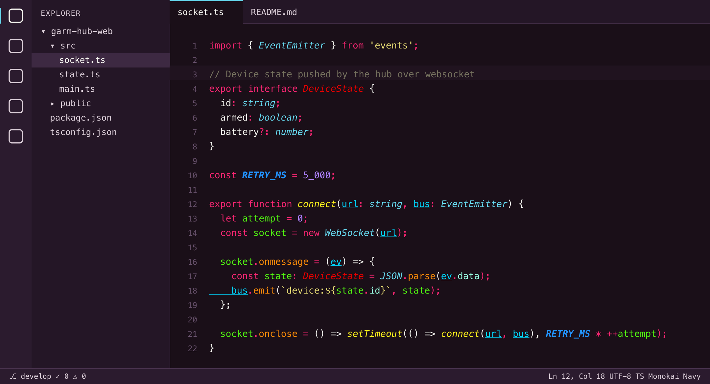
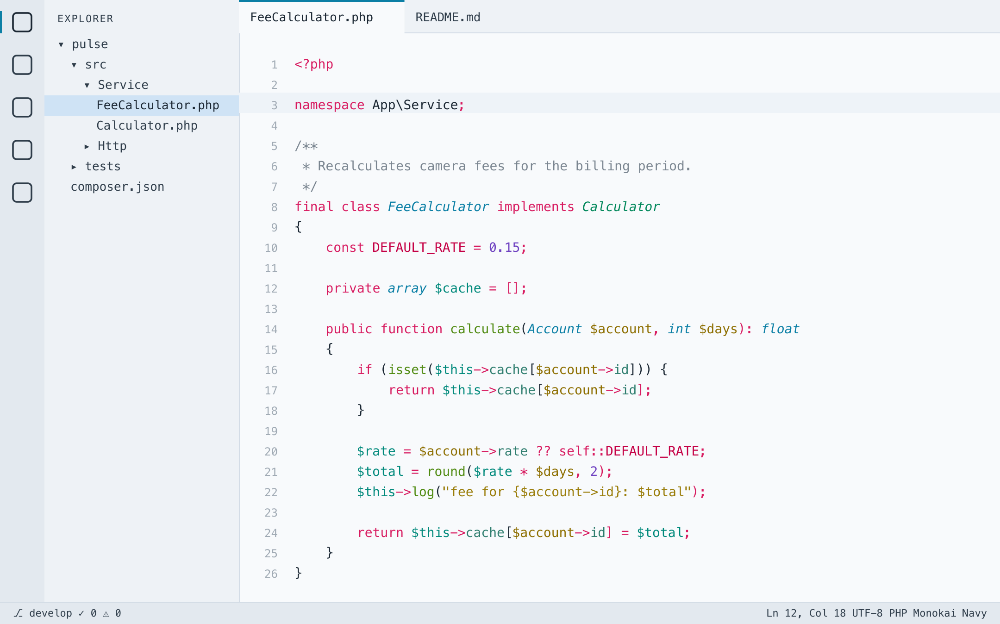
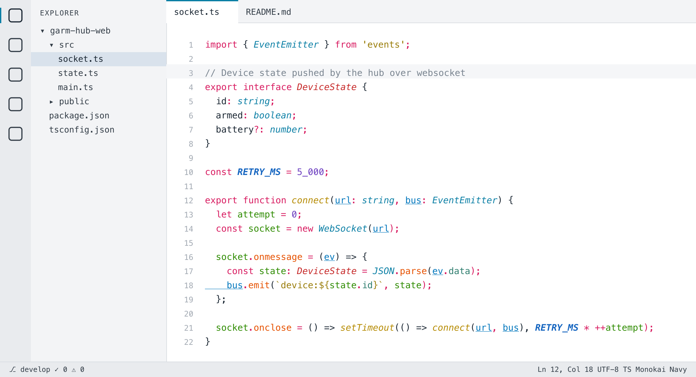

# Monokai Navy

Monokai as I have it in PhpStorm, ported to VS Code — the classic Sublime Text 3 palette
on a deep navy `#0b1823` instead of the usual olive-black, with the whole workbench
(sidebar, tabs, panels, terminal, inputs) painted in the same navy family.

Five variants: **Monokai Navy** (blue), **Monokai Navy Grey**, **Monokai Navy Pink** (plum)
share the syntax colours and differ only in the workbench ramp; **Monokai Navy Light** (cool
tint) and **Monokai Navy White** (pure white, neutral greys) are the same family of hues
re-tuned for a light page.







## Variants

The editor is always the darkest surface; sidebar, frame and popups step up from it like
JetBrains tool windows. Pick one with `Cmd+K Cmd+T`:

| Theme | Editor | Tool windows | Frame | Popups |
|---|---|---|---|---|
| **Monokai Navy** (blue) | `#0b1823` | `#112232` | `#152a3d` | `#183044` |
| **Monokai Navy Grey** | `#131517` | `#1b1e21` | `#202428` | `#24282d` |
| **Monokai Navy Pink** (plum) | `#1a0f18` | `#241626` | `#2b1b2e` | `#302035` |
| **Monokai Navy Light** | `#f8fafc` | `#eef2f6` | `#e3e9ef` | `#ffffff` |
| **Monokai Navy White** | `#ffffff` | `#f3f4f6` | `#e9ebee` | `#ffffff` |









## What's inside

- **Token colours** come from a PhpStorm `.icls` scheme, not from a VS Code Monokai fork:
  keywords, operators and punctuation `#f92672`, strings `#e6db74`, numbers and constants
  `#ae81ff`, functions `#a7ec21`, classes `#66d9ef` *italic*, comments `#75715e`.
- **PHP** gets its own layer: variables `#00c0b0`, properties `#98ffe0`, parameters
  `#e9ff65`, constants `#ff0057`, interfaces `#00ffa6`.
- **JS / TS** are coloured through semantic tokens from the built-in TypeScript server:
  locals `#51f611`, module-level variables `#2293ff` **bold italic**, parameters
  `#00d7ff` underlined, methods `#f88908`, functions `#fff21c` *italic*, interfaces red.
- **Workbench**: navy ramp `#0b1823` → `#112232` → `#152a3d` → `#183044`, list selection
  `#1f3c55`, borders `#24425c`, accent `#66d9ef` (see the variants table for the others).
- **Terminal**: a proper Monokai ANSI palette on the editor background.

## Install

Not on the Marketplace yet. From this repo:

```sh
git clone https://github.com/fosteev/monokai-navy
cd monokai-navy
npx @vscode/vsce package
code --install-extension monokai-navy-1.3.0.vsix
```

Restart VS Code, then `Cmd+K Cmd+T` → **Monokai Navy** / **Grey** / **Pink** / **Light** / **White**.

Recommended companions: `"terminal.integrated.minimumContrastRatio": 1` (otherwise
VS Code re-tints terminal colours), and JetBrains Mono as `editor.fontFamily` — that is
the font the original scheme was tuned on.

## Regenerating from a PhpStorm scheme

`tools/icls2vscode.py` turns any JetBrains `.icls` into this extension, using VS Code's
built-in Monokai as the fallback for scopes the scheme does not define:

```sh
python3 tools/icls2vscode.py \
  ~/Library/Application\ Support/JetBrains/PhpStorm*/colors/My\ Scheme.icls \
  /Applications/Visual\ Studio\ Code.app/Contents/Resources/app/extensions/theme-monokai/themes/monokai-color-theme.json \
  .          # or ./build to keep the repo untouched
python3 tools/build_light.py && python3 tools/check_theme.py && python3 tools/render_preview.py
```

`tools/source.icls` is the scheme this theme came from. The navy workbench colours and a
few fixes on top of the PhpStorm values live in `tools/navy.json` — it is applied as the
last layer, so edit it (not `themes/`) and regenerate. `tools/variants.json` maps the Blue
ramp to the Grey and Pink ones and the converter writes one theme file per variant;
`tools/build_light.py` then derives the light variant from the blue one through a
dark→light colour map, and White from Light through another ramp map. `tools/check_theme.py` lints every theme file (duplicate scopes,
low-contrast tokens, olive leftovers), and `tools/render_preview.py` redraws the pictures
above (SVG + PNG) from the theme files, so they never drift from the actual colours.

## Notes

- PHP is highlighted by the TextMate grammar unless a language server (Intelephense,
  PHP Tools) is installed; semantic rules for `php` are already in the theme and kick in
  automatically.
- Font settings are not part of a colour theme — set `editor.fontFamily` yourself.

MIT © Andrey Fosteev
