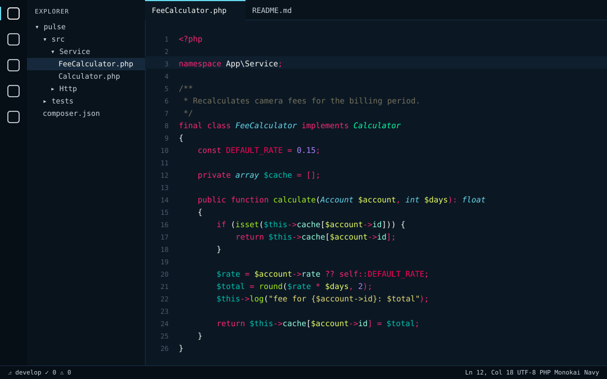
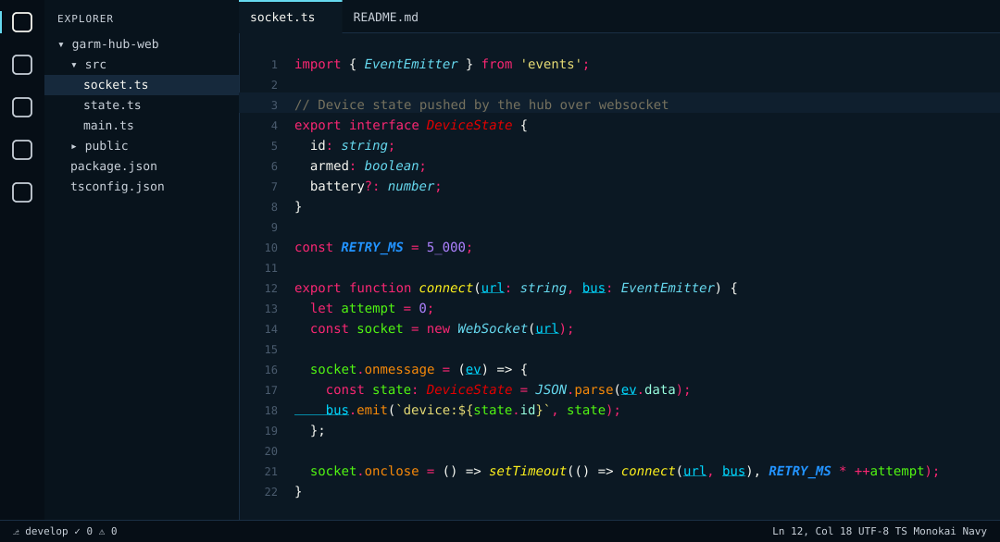
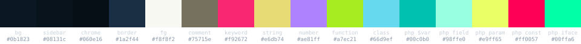

# Monokai Navy

Monokai as I have it in PhpStorm, ported to VS Code — the classic Sublime Text 3 palette
on a deep navy `#0b1823` instead of the usual olive-black, with the whole workbench
(sidebar, tabs, panels, terminal, inputs) painted in the same navy family.







## What's inside

- **Token colours** come from a PhpStorm `.icls` scheme, not from a VS Code Monokai fork:
  keywords, operators and punctuation `#f92672`, strings `#e6db74`, numbers and constants
  `#ae81ff`, functions `#a7ec21`, classes `#66d9ef` *italic*, comments `#75715e`.
- **PHP** gets its own layer: variables `#00c0b0`, properties `#98ffe0`, parameters
  `#e9ff65`, constants `#ff0057`, interfaces `#00ffa6`.
- **JS / TS** are coloured through semantic tokens from the built-in TypeScript server:
  locals `#51f611`, module-level variables `#2293ff` **bold italic**, parameters
  `#00d7ff` underlined, methods `#f88908`, functions `#fff21c` *italic*, interfaces red.
- **Workbench**: editor `#0b1823`, sidebar `#08131c`, activity/status bar `#060e16`,
  widgets `#10202f`, borders `#1a2f44`, accent `#66d9ef`.
- **Terminal**: a proper Monokai ANSI palette on the editor background.

## Install

Not on the Marketplace yet. From this repo:

```sh
git clone https://github.com/fosteev/monokai-navy
cd monokai-navy
npx @vscode/vsce package
code --install-extension monokai-navy-1.0.0.vsix
```

Restart VS Code, then `Cmd+K Cmd+T` → **Monokai Navy**.

Recommended companions: `"terminal.integrated.minimumContrastRatio": 1` (otherwise
VS Code re-tints terminal colours), and JetBrains Mono as `editor.fontFamily` — that is
the font the original scheme was tuned on.

## Regenerating from a PhpStorm scheme

`tools/icls2vscode.py` turns any JetBrains `.icls` into this extension, using VS Code's
built-in Monokai as the fallback for scopes the scheme does not define:

```sh
python3 tools/icls2vscode.py \
  ~/Library/Application\ Support/JetBrains/PhpStorm*/colors/My\ Scheme.icls \
  /Applications/Visual\ Studio\ Code.app/Contents/Resources/app/extensions/theme-monokai/themes/monokai-color-theme.json \
  ./build
```

`tools/source.icls` is the scheme this theme came from; the navy workbench colours were
layered on top by hand. `tools/render_preview.py` redraws the pictures above from the
theme file, so they never drift from the actual colours.

## Notes

- PHP is highlighted by the TextMate grammar unless a language server (Intelephense,
  PHP Tools) is installed; semantic rules for `php` are already in the theme and kick in
  automatically.
- Font settings are not part of a colour theme — set `editor.fontFamily` yourself.

MIT © Andrey Fosteev
